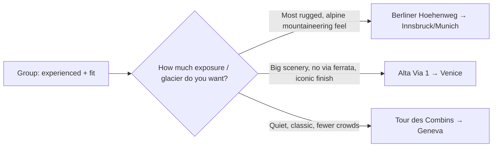

## Question

For a \~1-week August trip by an **experienced, fit** hiking group wanting a **self-guided, hut/inn** multi-day trek with an optional big-city finish — which Alpine route, among the two candidates (Tour des Combins, Berliner Höhenweg) plus a strong third (Alta Via 1)?

## Sources cited

- [Tour des Combins](../external-sources/hike-tour-des-combins.md)
- [Berliner Höhenweg](../external-sources/hike-berliner-hoehenweg.md)
- [Alta Via 1 (Dolomites)](../external-sources/hike-alta-via-1-dolomites.md)
- [Flight pricing](../external-sources/logistics-flights-august.md)

## Findings

All three are hut-to-hut, self-guideable, and in season in August. They differ most on **technical difficulty/exposure** and **which city you finish in.**

| Route | Days / Distance / Gain | Difficulty | Technical exposure | City finish | Crowds |
| --- | --- | --- | --- | --- | --- |
| **Tour des Combins** (CH/IT) | 7–11 d / 140 km / 8,450 m | Moderately challenging | Non-technical; long days, \~1,000 m/day ([src](../external-sources/hike-tour-des-combins.md)) | **Geneva** (or Milan/Turin) | Quiet |
| **Berliner Höhenweg** (AT) | 7 d / \~71–85 km / 5,300–6,600 m | **Difficult (5/6 tech)** | **High, glaciated; cabled sections need a harness + crampons** ([src](../external-sources/hike-berliner-hoehenweg.md)) | **Innsbruck / Munich** | Moderate |
| **Alta Via 1** (IT) | 6–10 d / 120 km / 7,400 m | Moderately difficult | Exposed ridges but **no via ferrata required** ([src](../external-sources/hike-alta-via-1-dolomites.md)) | **Venice** | Busy (book early) |

**The key fork is exposure.** ([Berliner](../external-sources/hike-berliner-hoehenweg.md) vs [Combins](../external-sources/hike-tour-des-combins.md))

> [!IMPORTANT]
> The **Berliner Höhenweg is the demanding end** — high alpine, glacier-adjacent, with secured/cabled passages requiring a harness and crampons, rated 5/6 technique. Very rewarding for a confident, sure-footed group, but it's genuinely mountaineering-flavored, not just long walking. The **Tour des Combins** and **Alta Via 1** deliver big-mountain days *without* that technical commitment.

**Scenery & "specialness."** Alta Via 1 runs through the UNESCO Dolomites ("fairyland of the Alps" — limestone pinnacles, alpine lakes, WWI history) and ends a train ride from **Venice** — the best scenery-plus-city-finish combination. ([src](../external-sources/hike-alta-via-1-dolomites.md))

**Crowds & booking.** Tour des Combins is the quietest ([src](../external-sources/hike-tour-des-combins.md)). Alta Via 1 is popular and its rifugios book months ahead — **August is the hardest to reserve late** ([src](../external-sources/hike-alta-via-1-dolomites.md)). Berliner huts are moderate but also need reservations.

**Fitness/time fit for one week.** All exceed 7 pure hiking days at full length; for a week-with-a-city-finish, plan a **5–6 day core** (skip/shuttle a stage or two) + 1–2 city days. Daily \~1,000 m gain on Combins and sustained climbs on all three suit a fit group.

**Cost.** Hut-to-hut self-guided runs roughly **€700–1,200/person on the ground** (huts w/ half-board ~~CHF/€60–120/night) ([Combins](../external-sources/hike-tour-des-combins.md), [AV1](../external-sources/hike-alta-via-1-dolomites.md)). With flights (~~$700–1,100 RT), a week lands \~$1.7–2.7k/person — inside mid budget. Switzerland (Combins) is the priciest on food/transport. ([flights](../external-sources/logistics-flights-august.md))

## Open questions

- Confirm the group's appetite for cabled/glaciated terrain → keep or drop Berliner Höhenweg.
- August rifugio availability for Alta Via 1 (book ASAP if chosen).
- Exact 5–6 day core itinerary + which stages to shuttle for a 1-week shape.
- Which city finish is most wanted (Venice / Geneva / Innsbruck-Munich) — this could itself decide the route.

