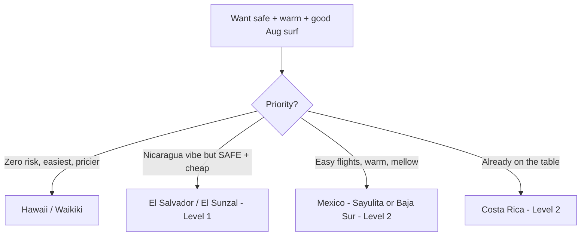

## Question

Nicaragua is **Level 3 "Reconsider Travel."** What other warm, beginner-friendly, good-August surf destinations are there **without** that advisory? Follow-up to [Nicaragua vs Costa Rica](./nicaragua-vs-costa-rica.md).

## Sources cited

- [Safe surf alternatives + advisory levels](../external-sources/safe-surf-alternatives.md)
- [Nicaragua (Level 3, for contrast)](../external-sources/nicaragua-surf.md)
- [August conditions](../external-sources/surf-conditions-august.md)
- [Flights](../external-sources/logistics-flights-august.md)

## Advisory levels, ranked safest-first

| Destination | US advisory | Aug surf (beginner fit) | Water | Flights from NYC/SF | On-ground cost |
| --- | --- | --- | --- | --- | --- |
| 🏝️ **Hawaii (Waikiki)** | **None** (domestic) | South swell 2–5 ft; Canoes/Queens textbook-mellow | 27 °C | Nonstop SFO; nonstop/1-stop NYC | **$$ higher** |
| 🇸🇻 **El Salvador (El Sunzal)** | **Level 1** ✅ | Peak swell; El Sunzal "most forgiving learning wave in C.A." (stay inside on big days) | 27–28 °C | 1 stop → SAL **+45 min** | **$ low** |
| 🇲🇽 **Mexico – Sayulita (Nayarit)** | Level 2 | Mellow beach break; hurricane-season caveat | warm | Nonstop/1-stop → PVR +45 min | $ low–mid |
| 🇲🇽 **Mexico – Baja Sur (Cerritos)** | Level 2 | Playa Cerritos beginner beach break | warm | Nonstop → SJD (esp. SFO) +1 h | $ mid |
| 🇨🇷 **Costa Rica** (have it) | Level 2 | Peak; Guiones/Sámara/Tamarindo | 29–30 °C | **Nonstop** to LIR | $ mid |
| 🇵🇹🇪🇸 **Portugal / Spain** (have them) | Level 2 | Small, forgiving (Spain flat-risk) | 20–25 °C | Nonstop (NYC) | $ mid |
| 🇭🇳 ~~Nicaragua~~ | **Level 3** ⛔ | Best wind, but the advisory | 27–28 °C | 1 stop + 2.5–3 h | $ low |

## The standout: El Salvador

> [!TIP]
> **El Salvador is the direct, safer answer to Nicaragua.** It's now **Level 1** (safer *on paper* than Costa Rica's Level 2), with the same warm, cheap, peak-August Central American surf — plus a **45-minute** airport transfer (vs Nicaragua's 2.5–3 h) and **El Sunzal**, "the most forgiving learning wave in Central America" where 3–5-day progress is realistic for first-timers. Trade-off: it's a **point-break coast** that gets powerful at peak swell, so beginners stick to El Sunzal / El Tunco inside / La Paz. See the [El Salvador proposal](../trips/surf-el-salvador.md).

## How they stack up for THIS group

- **Safest + easiest, accept higher cost → Hawaii (Waikiki).** No advisory, no passport, nonstop from SFO, the world's most beginner-stocked lineup. The premium, low-adventure pick.
- **Best safe "adventure" value → El Salvador (Level 1).** Warm, cheap, consistent, short transfer; the upgrade over Nicaragua.
- **Easy + warm + Level 2 → Mexico (Sayulita / Baja Sur).** Nonstop-friendly, mellow beginner beaches; watch Aug hurricane season in Nayarit.
- **Already proposed → Costa Rica (Level 2, nonstop).** Still the balanced default.

## Open questions

- Does the group want **Level 1/none only** (→ El Salvador or Hawaii), or is **Level 2 fine** (→ opens Costa Rica/Mexico/Portugal/Spain)?
- Hawaii budget tolerance (it's the priciest); El Salvador point-break comfort.
- Worth full proposals for Hawaii and/or Mexico if either is a real contender (only El Salvador has one so far).
- Advisories shift — re-check State Dept before booking.