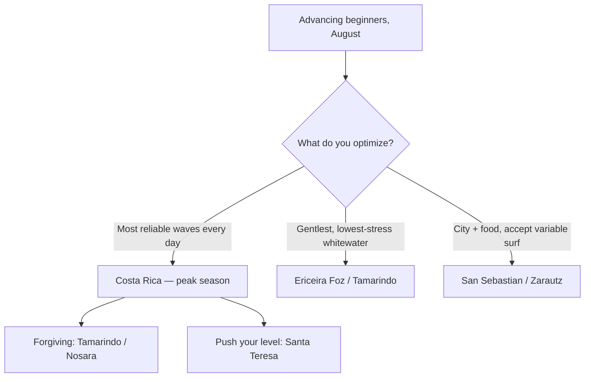

## Question

What are the **actual August surf conditions** at each candidate spot — wave size, water temp, wind, consistency, crowds — and which best fits an **advancing-beginner** group? Companion to [surf options](./surf-trip-options.md), [independent surf](./surf-independent-and-city-surf.md), and the [camp comparison](./surf-camp-comparison.md).

## Sources cited

- [August conditions by spot](../external-sources/surf-conditions-august.md)
- [Costa Rica seasons](../external-sources/surf-costa-rica-seasons.md)
- [San Sebastián](../external-sources/surf-san-sebastian.md)

## Side-by-side (August)

| Spot | Typical waves | Sets | Water temp | Wind pattern | Consistency | Crowds | Level fit |
| --- | --- | --- | --- | --- | --- | --- | --- |
| **Ericeira (Foz do Lizandro)** 🇵🇹 | Knee–waist high | small | 20–22 °C (can drop to 15) | Nortada onshore from midday → **AM only** | Medium (some flat spells) | Busy | **Gentlest** — great learners' beach |
| **Zarautz / San Sebastián** 🇪🇸 | Small, <1.5 m | small | 20–25 °C (warmest) | Cool, cloudy, frequent rain | **Lowest** (summer = flat season) | Crowded | Fine for beginners *on the days it works* |
| **Nosara (Guiones)** 🇨🇷 | 2–3 ft | 3–4 ft+ | 29–30 °C | Glassy AM offshore, PM onshore+rain | **High** (peak season) | Moderate | Improver-friendly; versatile inside |
| **Santa Teresa** 🇨🇷 | 2–3 ft | **3–5 ft** | 29–30 °C | Glassy AM offshore | **High** | Lively | **Punchiest** — favors intermediates |
| **Tamarindo (Dreamsea)** 🇨🇷 | 3–5 ft, mellow @ high tide | — | 25–30 °C | AM offshore | **High** | Manageable | **Forgiving** — top learn-to-surf break |

## What it means for your group

> [!IMPORTANT]
> **Three honest takeaways:**
> 1. **Costa Rica is the surfer's choice in August** — it's *peak season*, so you'll get consistent, glassy, offshore mornings nearly every day (water 29–30 °C, no wetsuit). Within it: **Tamarindo/Nosara are forgiving**, **Santa Teresa is punchier** (sets to 5 ft favor intermediates). The catch is afternoon rain and no real city.
> 2. **Ericeira is the gentlest classroom** — small, forgiving whitewater at Foz do Lizandro — but summer waves are *smaller and less consistent* than Costa Rica, water is colder (wetsuit; the Nortada can crash it to 15 °C), and you **must surf mornings** before the onshore wind.
> 3. **San Sebastián is the riskiest for waves** — Basque summer is the small/flat season and it's the cloudiest/wettest of the three. Pick it when the **city and food are the headline** and surf is the bonus, not the reverse.

> [!TIP]
> **Universal rule for all five spots: surf in the morning.** Portugal's Nortada and Costa Rica's afternoon onshore both clean up at dawn. Plan dawn-patrol sessions and lazy/explore afternoons.

## Costa Rica — which break, by level (August)

"Costa Rica" is really a dozen breaks with very different difficulty. In August (green-season S/SW swell), the Pacific beach breaks are consistent; reefs/points like Playa Negra are weaker (they peak Nov–Apr). For an advancing-beginner group, base near a **sandy beach break** and treat the reefs as look-don't-touch.

| Break | Area | Type | August difficulty | For your group |
| --- | --- | --- | --- | --- |
| **Playa Sámara** | Sámara | Reef-protected bay | Waist–chest at high tide | 🟢 **Gentlest** — best pure-beginner base |
| **Playa Guiones** | Nosara | Sandy beach break | All levels, consistent | 🟢 **Best learn-and-improve** spot |
| **Playa Carmen** | Santa Teresa | Beach break | Less powerful, mind rips | 🟢 Beginner-suited |
| **Playa Tamarindo** | Tamarindo | River-mouth sand | Gradual takeoffs | 🟢 Most beginner-friendly in its area |
| **Playa Hermosa (ST)** | Santa Teresa | Beach break | Mellow small days; huge on big swell | 🟡 Beginner *small days only* |
| **Playa Santa Teresa (main)** | Santa Teresa | Punchy beach break | Upper-beginner/intermediate | 🟡 Step-up |
| **Playa Avellanas** | Guanacaste | Multi-peak beach | Beginner calm days → advanced big days | 🟡 Versatile; pick your peak |
| **Playa Grande** | Tamarindo | Beach break | Main peak fast/hollow; mellower down the beach | 🟡 Intermediate (avoid main peak) |
| **Playa Pelada** | Nosara | Reef | Intermediate | 🟠 Reef — once you progress |
| **Mal País** | S. of Santa Teresa | Reef | Heavy | 🔴 Intermediate/advanced |
| **Playa Carrillo** | S. of Sámara | Point | Head-high south end | 🔴 Intermediate/advanced |
| **Playa Negra** | Guanacaste | Shallow rock reef/point | Fast; best Nov–Apr | 🔴 Advanced |

> [!TIP]
> **Base → home break:** **Sámara** (Playa Sámara, gentlest) · **Nosara** (Playa Guiones, versatile, but mind [rainy-season road/bridge access](./costa-rica-surf-hostels.md)) · **Santa Teresa** (Playa Carmen to learn, main beach to step up) · **Tamarindo** (Playa Tamarindo to learn, Avellanas/Playa Grande to progress). All four put a beginner-friendly sandy break and a step-up option within reach.

## Bottom line vs. the trip picks

- Choosing for **surf quality + reliability** → **Costa Rica** (Tamarindo/Nosara to stay forgiving; Santa Teresa to push). See [Costa Rica proposal](../trips/surf-costa-rica-nosara.md).
- Choosing for **gentle learning + an easy Lisbon finish** → **Ericeira**, accepting smaller/variable waves. See [Portugal proposal](../trips/surf-portugal-ericeira.md).
- Choosing for **a world-class city** with surf as a bonus → **San Sebastián**, knowing some days may be flat. See [San Sebastián proposal](../trips/surf-san-sebastian-independent.md).

## Open questions

- These are climatological norms — **check live forecasts ~10 days out** (Surfline / surf-forecast / Windy) once dates lock.
- If reliability matters most, weight Costa Rica; if a flat-day backup matters, confirm nearby alternates (Ericeira has many breaks; San Sebastián has Mundaka/Sopelana day trips).
