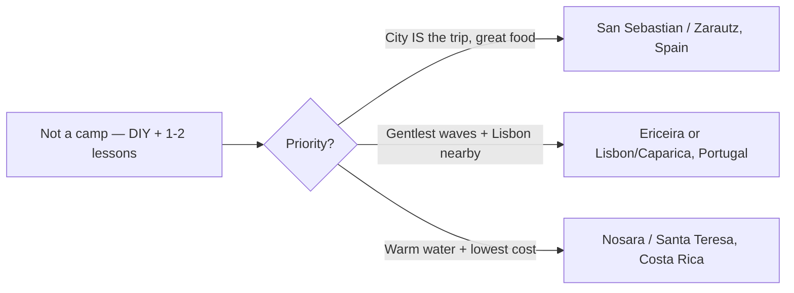

## Question

The group can already stand up and ride small waves — they don't need a full surf camp. **What are good non-camp surf options where you book your own lodging, surf independently, and take just 1–2 lessons / private coaching sessions?** Follow-up to [surf-trip-options](./surf-trip-options.md).

## Sources cited

- [À-la-carte lesson + board-rental pricing](../external-sources/surf-independent-lessons-rentals.md)
- [San Sebastián / Zarautz](../external-sources/surf-san-sebastian.md)
- [Ericeira camps & conditions](../external-sources/surf-ericeira-camps.md)
- [Costa Rica seasons](../external-sources/surf-costa-rica-seasons.md)
- [Flights](../external-sources/logistics-flights-august.md)

## Findings

**The independent model is cheap and flexible.** A week of board rental + 2 drop-in/private lessons runs only **~$200–300 of surf services** — vs. €500–800 for a camp — because rentals are ~€15–25/day and single lessons are ~€40 (Portugal) / $50–70 (Costa Rica). You keep your own schedule and pick lodging freely. ([pricing](../external-sources/surf-independent-lessons-rentals.md))

> [!TIP]
> For an advancing-beginner group, the sweet spot is: **rent boards for the week, surf the gentle beach-break mornings yourselves, and book 1–2 private/semi-private coaching sessions** to fix specific things (pop-up timing, reading the wave, going down the line). That's more useful per dollar than 5 straight days of group lessons.

**Every destination already works this way** — Ericeira and Costa Rica from the [first surf round](./surf-trip-options.md) are fully DIY-able; the camp was always optional. ([pricing](../external-sources/surf-independent-lessons-rentals.md))

**The model unlocks a standout: San Sebastián, Spain.** Here the surf base *is* a major city, so the "surf town → city finish" two-stop logistics collapse into one place:

| Factor | San Sebastián / Zarautz |
| --- | --- |
| Surf | Zarautz: 2.5 km beginner beach, "almost always ideal," 15–20 min from city; Zurriola break in town ([src](../external-sources/surf-san-sebastian.md)) |
| City | World-class food (pintxos, La Concha, Michelin density) — the city *is* the headline |
| Lessons | Private from ~€76; group packs (~€210/7) ([src](../external-sources/surf-san-sebastian.md)) |
| Access | EAS / Bilbao (~1h15) / Biarritz (~45 min); easy add-on Bilbao or Biarritz |
| Aug waves | Summer = mellow learner season; wetsuit needed |

**Cost comparison (per person, independent model).** All cheaper than the camp versions:

| Option | Lodging 6–7 nts (own) | Surf (rental + 2 lessons) | Flights (NYC/SF) | Week total |
| --- | --- | --- | --- | --- |
| San Sebastián | $90–160/nt → $550–1,100 | ~€150–220 (~$170–240) | $700–1,100 | **~$1.6–2.7k** |
| Ericeira/Lisbon | $70–130/nt → $450–900 | ~€110–150 (~$120–165) | $500–1,000 | **~$1.3–2.4k** |
| Costa Rica | $60–120/nt → $400–840 | ~$190–290 | $400–800 | **~$1.2–2.2k** |

([pricing](../external-sources/surf-independent-lessons-rentals.md), [flights](../external-sources/logistics-flights-august.md))

## Open questions

- San Sebastián vs. Ericeira as the lead DIY pick — food-city-first vs. gentlest-waves-first.
- Lodging style for the group (shared Airbnb is most economical for 2–4).
- Book private vs. group lessons; pre-book the 1–2 sessions or arrange on arrival (summer demand).
- Exact August water temp / wetsuit thickness per spot.
