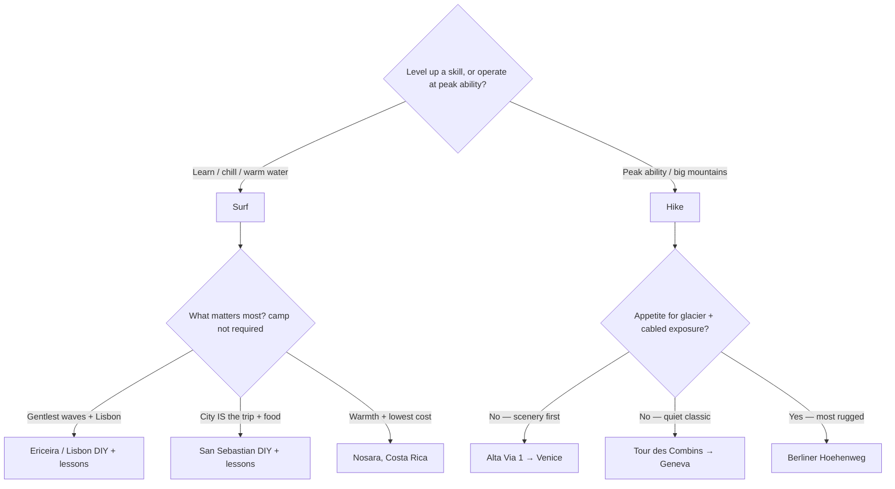

## Overview

Decision hub for the **~1-week August trip**: surfing vs. multi-day hiking, for a group of 2–4 (NYC + SF), mid budget (~$1.5–3k/person), flexible August dates, wanting an optional big-city finish. Every option below comes in **inside budget**, so the real choice is about **experience**, not money.

- **You're advancing-beginner surfers** but **experienced, fit hikers.** That asymmetry matters: the hiking trips let you operate near the top of your ability for a peak experience; the surf trips are about leveling up with coaching. Both are great — they're just different kinds of week.

Detailed analysis: [surf options](../research/surf-trip-options.md) · [Alpine hike options](../research/alpine-hike-options.md).

## The five proposals at a glance

| # | Proposal | Type | Intensity | City finish | Est. $/person |
| --- | --- | --- | --- | --- | --- |
| 1 | [Surf — Ericeira / Lisbon, Portugal](./surf-portugal-ericeira.md) | Surf | Gentle; **camp *or* DIY+lessons** | **Lisbon** (40 min) | $1.3–2.7k |
| 2 | [Surf — San Sebastián, Spain](./surf-san-sebastian-independent.md) | Surf | **DIY + 1–2 lessons** | **City is the base** | $1.6–2.7k |
| 3 | [Surf — Nosara, Costa Rica](./surf-costa-rica-nosara.md) | Surf | Ambitious; **camp *or* DIY** | — (San José) | $1.2–2.3k |
| 4 | [Surf — Nicaragua (SJDS / Popoyo)](./surf-nicaragua.md) | Surf | **All-day offshores; cheaper**; ⚠️ Level 3 advisory | — | $1.1–2.2k |
| 5 | [Hike — Alta Via 1, Dolomites](./hike-alta-via-1-dolomites.md) | Hike | Big days, **no via ferrata** | **Venice** | $1.5–2.5k |
| 6 | [Hike — Tour des Combins](./hike-tour-des-combins.md) | Hike | Demanding, non-technical, quiet | **Geneva** | $1.5–2.6k |
| 7 | [Hike — Berliner Höhenweg](./hike-berliner-hoehenweg.md) | Hike | **Most rugged** (glacier, cabled) | Innsbruck/Munich | $1.45–2.4k |

## Recommendation

> [!TIP]
> **If you want to surf →** you don't need a full camp. **[Ericeira / Lisbon, Portugal](./surf-portugal-ericeira.md)** has the most forgiving August waves — rent boards, surf yourselves, add 1–2 lessons, and base in Lisbon to fold the city in. **[San Sebastián, Spain](./surf-san-sebastian-independent.md)** is the standout if you want the *city to be the trip* (world-class food + a beginner beach 15 min away, surfed independently with a couple of lessons). **[Costa Rica](./surf-costa-rica-nosara.md)** is the warm-water, lowest-cost pick — book coached mornings since August swells favor intermediates. **[Nicaragua](./surf-nicaragua.md)** is the budget, uncrowded, all-day-offshore wildcard — better waves but a **Level 3 "Reconsider Travel" advisory** ([Nicaragua vs Costa Rica](../research/nicaragua-vs-costa-rica.md)). See the [independent (non-camp) surf research](../research/surf-independent-and-city-surf.md), the [surf camp comparison](../research/surf-camp-comparison.md) (Portugal vs Spain vs Costa Rica, bundle vs à-la-carte), and the [August surf conditions](../research/surf-conditions-august.md) (Costa Rica is peak/most consistent; Spain riskiest for flat days).
>
> **If you want to hike →** the cleanest fit is **[Alta Via 1 in the Dolomites](./hike-alta-via-1-dolomites.md)**: the most spectacular scenery, big days without technical/glacier commitment, and a Venice finish — *book rifugios immediately, as August fills*. Choose **[Tour des Combins](./hike-tour-des-combins.md)** if you value quiet and late-booking flexibility, or **[Berliner Höhenweg](./hike-berliner-hoehenweg.md)** if the group actively *wants* exposure, cables, and a glacier-adjacent challenge.

## How to decide (fast)

## Next steps

1. **Pick lane** (surf vs hike) and a **top route** from above.
2. **Lock the August week** → pull live airfares. Concrete mid-August routings (NYC nonstops; SF single-stop) are in [flight examples](../research/flight-examples-mid-august.md) (Costa Rica cheapest/shortest; Lisbon cheapest in Europe from NYC).
3. **Book the perishable thing first:** surf camp slots, or — critically — **Alta Via 1 rifugios** (months ahead in August).
4. Confirm group comfort: for Berliner Höhenweg, that everyone is OK with exposure/cables; for Costa Rica, that you'll book coached mornings.

## Cost Breakdown

All five land **~$1.4–2.7k/person**, comfortably within the mid budget. Full per-trip breakdowns live in each proposal (flights + lodging + food + local transport). Switzerland (Tour des Combins) is the priciest on the ground; Costa Rica is the cheapest overall. Flight floors and gateways: [logistics](../external-sources/logistics-flights-august.md).
